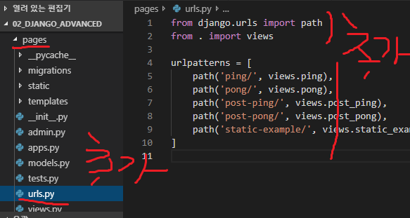
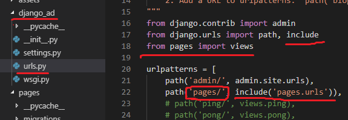
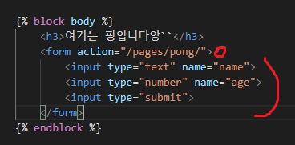
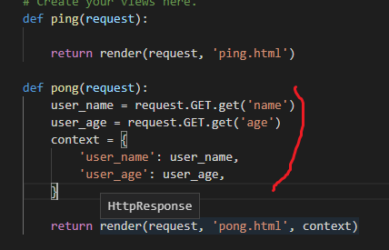

# django: urls.py 또 만들어서 연결, form태그 사용

#### 상황1. 프로젝트 내부에  app들을 추가할때 도메인이 비슷할 수도 있는 경우가 있기때문에 app별로 urls.py를 추가해 줘야함~~~~

- 새로추가한 app에 urls.py를 추가해 주고 오른쪽과 같이 import와 urlpatterns를 추가해줌

- import 해주고 include를 해줌

##### 상황2. form태그 사용

- html에서

  

- views.py

