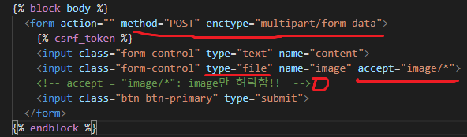
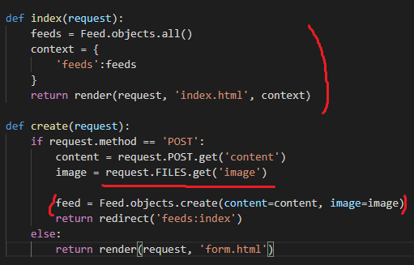
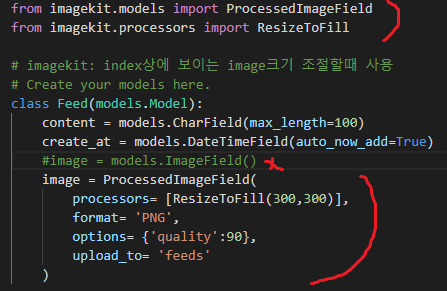
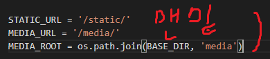
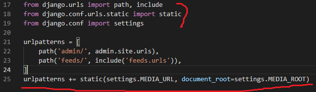
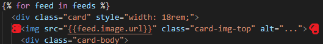
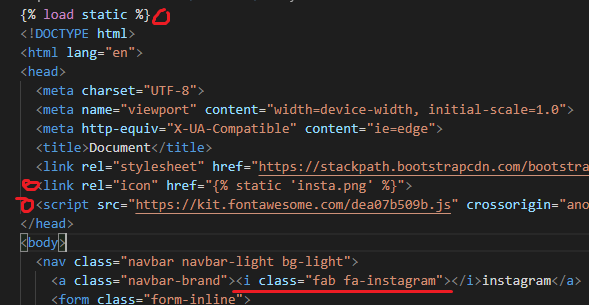
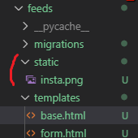

# 파일 올리기, icon 설정

#### 파일올리기

- form.html



- views.py



- models.py

```bash
pip install pilkit django-imagekit
```



- settings



- urls.py

  


- index.html




#### icon설정

- base.html

  

- static 폴더 만들어주고 파일추가

  