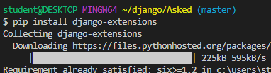
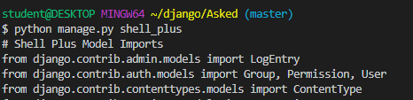

# django ORM

#### django-extension 설치



#### 실행



#### 게시물 불러오기

```python
In [8]: question = Question.objects.get(id=1)

In [9]: question
Out[9]: <Question: Question object (1)>
```


#### 댓글 생성

```python
In [11]: answer = Answer()
    
In [15]: answer
Out[15]: <Answer: Answer object (None)>

In [16]: answer.content
Out[16]: ''

In [17]: answer.content = "이것은 댓글입니다."

In [18]: answer
Out[18]: <Answer: Answer object (None)>

In [22]: answer.question = question
In [25]: answer.save()
    
In [26]: answer
Out[26]: <Answer: Answer object (1)>

In [29]: Answer.objects.create(content="두번째", question=
    ...: question)
Out[29]: <Answer: Answer object (2)>
```


#### 댓글 정보

```python
In [31]: answer.content
Out[31]: '이것은 댓글입니다.'

In [32]: answer.question
Out[32]: <Question: Question object (1)>
        
In [33]: answer.id
Out[33]: 1

In [34]: answer.pk
Out[34]: 1

In [35]: question.pk
Out[35]: 1
    
In [36]: answer.question_id
Out[36]: 1

In [37]: answer.question.id
Out[37]: 1
```


# 1:N

- Question(1): Answer(N)

  ```python
  In [37]: question.answer_set.all()
  Out[37]: <QuerySet [<Answer: Answer object (1)>, <Answer: Answer object (2)>, <Answer: Answer object (3)>]>
  ```

  - ```question.answer``` 로는 가져올 수 없다.
  - 항상 복수라고 생각해야됨

- Answer(N) => Question(1) : question

  ```python
  In [27]: answer.question
  Out[27]: <Question: Question object (1)>
  ```

  


