# web-django

### MTV패턴
##### 자바의 MVC패턴 django의 MTV패턴

- Model: 데이터를 관리
- Template: 사용자가 보는 화면
- View: 중간관리자


### django 가상환경 설정

- 파이썬 가상환경 만들기

  ```pyth
  python -m venv 가상환경이름
  python -m venv venv
  ```


- 가상환경진입하기

  ```bash
  source venv/Scripts/activate #탭으로 자동입력하자
  #진입하면 밑에 (venv)가 붙어있음
  ```

- dependency설치(CLI에 해당 가상환경에 진입되어있는 상황에서)

  ```bash
  pip install django
  ```

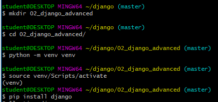


- 지금까지와는 별개로 venv의 환경을 구축함 pip list를 했을때 여태까지 설치한게 나오지 않음을 알수 있음

  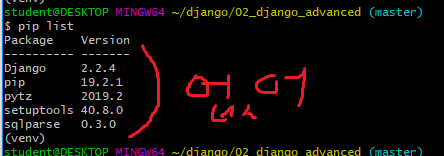

- 가상환경 해제

  ```bash
  deactivate
  #꼭 (venv)가 사라진거 확인하자
  ```

  


### 아래는 Vscode에서 하는방법 

- vs코드에서 F1으로 검색창 on

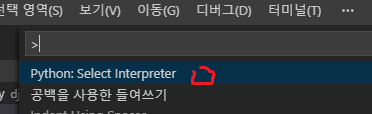

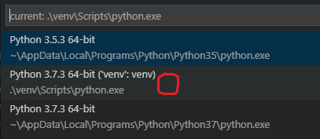

- 이제 vs코드에서 (venv)가 켜진 가상환경에 진입한 상태에서 터미널사용가능

### django 사용(이후 가상환경 진입한 상황)

- 프로젝트 생성

  ```bash
  django-admin startproject 프로젝트이름 . 
  # .점 필수!!!!!!!!!!!!!!!!!그래야 밑에 서버실행이 가능
  ```

- 서버실행(하기전에 앱먼저 생성하자)

  ```bash
  python manage.py runserver
  ```

- 앱 생성

  ```bash
  django-admin startapp 앱이름
  # 프로젝트 django_intro내부에 pages페이지를 만들어 이동하는데 사용!!! 꼭 해줘야됨
  ```

  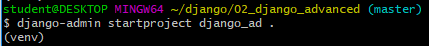

  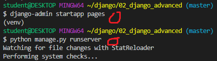


### 설정및 실습

- 프로젝트 pages를 만들었다고 시스템에게 알려줌

  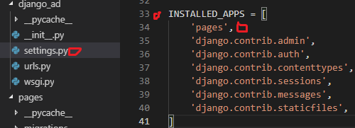

- 언어및 시간 설정

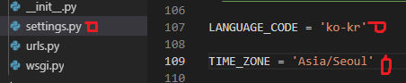

- urls.py

  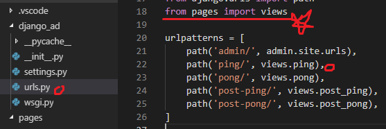

- views.py

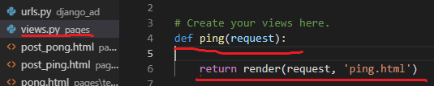

- html파일 만들기

  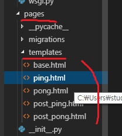

- 크롬확인

  실행전에 runserver를 해주소 터미널에서 주소가 나오면 ctrl + 클릭해서 크롬창이 뜨도록

  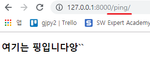